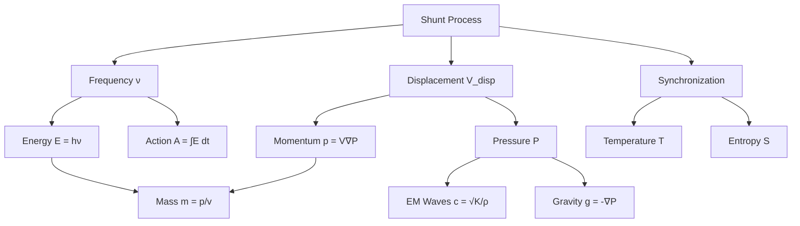
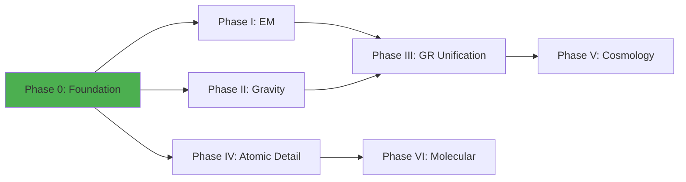

# **SPATIAL DISPLACEMENT THEORY**
# **PHASE 0 — FOUNDATIONAL FRAMEWORK**

**Master Outline & Agent Coordination Document**

---

## **DOCUMENT METADATA**

| Field | Value |
|-------|-------|
| **Phase** | 0 — Foundational Framework |
| **Version** | 0.1.0 (Initial Structure) |
| **Status** | OUTLINE — Awaiting Agent Execution |
| **Agent Count** | 4 (A, B, C, D) |
| **Target Length** | 120–180 pages |
| **Dependencies** | None (this is the foundation) |
| **Supports** | Phase I–XXVI (entire SDT program) |

---

## **EXECUTIVE SUMMARY**

Phase 0 establishes the complete foundational substrate of Spatial Displacement Theory:

- **What exists** (ontology)
- **How it moves** (shunt mechanics)
- **What emerges** (all physical laws)
- **Why it's stable** (cross-scale structures)
- **How we validate it** (benchmark framework)

This document is the **axiomatic core** of SDT.
All subsequent phases build directly on these primitives.

---

# **PART I — FOUR IRREDUCIBLE PRIMITIVES & FOUNDATIONAL ONTOLOGY**
## **[Agent A Deliverable]**

### **1.1 The Four Irreducible Primitives**

#### **1.1.1 Space (Spation Medium)**
- [ ] Definition: continuous, compressible, contact-only medium
- [ ] Spation radius (r_s)
- [ ] Spation density (ρ_s)
- [ ] Bulk modulus (K_bulk)
- [ ] Compressibility coefficient
- [ ] No gaps, no vacuum axiom

#### **1.1.2 Matter (Topological Exclusion)**
- [ ] Definition: regions where spations cannot exist
- [ ] Boundary surfaces
- [ ] Curvature term (κ)
- [ ] Volume exclusion principle
- [ ] Matter as "holes" in the spation field

#### **1.1.3 Movement (Shunt Mechanics)**
- [ ] Definition: discrete displacement of matter through spation medium
- [ ] Shunt as fundamental process
- [ ] Contact-only propagation
- [ ] Energy = kinetic movement (no potential energy)
- [ ] Displacement volume (V_disp)

#### **1.1.4 Now (Emergent Temporal Order)**
- [ ] Time emerges from ordered displacement sequences
- [ ] No pre-existing time dimension
- [ ] Causality from contact propagation
- [ ] "Now" as synchronized shunt state

### **1.2 Pressure Field Framework**

#### **1.2.1 Pressure Field Definition**
- [ ] P(r) as fundamental scalar field
- [ ] Relationship to displaced volume: P ∝ V_disp / V_available
- [ ] Gradient dynamics: F = -∇P
- [ ] Pressure equilibrium conditions

#### **1.2.2 Displacement Volume Mechanics**
- [ ] V_disp calculation for arbitrary shapes
- [ ] Boundary integral formulation
- [ ] Curvature contribution
- [ ] Multi-body displacement summation

#### **1.2.3 Bulk Modulus & Compressibility**
- [ ] K_bulk definition and derivation
- [ ] Pressure-density relationship
- [ ] Spation compression limits
- [ ] Wave propagation speed: c = √(K_bulk/ρ_s)

### **1.3 Dimensional Foundations**

#### **1.3.1 SDT Unit System**
- [ ] Primary units: displacement, frequency, volume
- [ ] Derived units: energy, momentum, mass
- [ ] Fundamental constants in SDT
- [ ] Dimensional analysis framework

#### **1.3.2 SI to SDT Conversion**
- [ ] Length: meters → spation radii
- [ ] Time: seconds → shunt cycles
- [ ] Energy: joules → displacement frequency products
- [ ] Conversion factor table

#### **1.3.3 Primitive SDT Constants**
- [ ] r_s (spation radius)
- [ ] ρ_s (spation density)
- [ ] K_bulk (bulk modulus)
- [ ] c (pressure wave speed)
- [ ] Calibration methodology

### **1.4 Mechanical Axioms**

#### **1.4.1 Contact-Only Ontology**
- [ ] No action at a distance
- [ ] All forces via pressure gradients
- [ ] Field as emergent from medium
- [ ] Rejection of field ontology

#### **1.4.2 No Gaps, No Vacuum**
- [ ] Space is fully occupied
- [ ] Matter displaces, doesn't create emptiness
- [ ] Vacuum reinterpreted as pressure minimum
- [ ] Cosmological implications

#### **1.4.3 All Energy is Kinetic**
- [ ] Rejection of potential energy as fundamental
- [ ] "Stored" energy = shunt frequency
- [ ] Binding energy as orbital shunt deficit
- [ ] Energy conservation from shunt conservation

### **1.5 Comparative Ontology**

#### **1.5.1 SDT vs. Spacetime**
- [ ] Why spacetime is emergent, not fundamental
- [ ] Metric as pressure gradient approximation
- [ ] Geodesics as pressure-balanced paths
- [ ] GR as large-scale limit

#### **1.5.2 SDT vs. Wavefunction Ontology**
- [ ] Why ψ is computational, not ontic
- [ ] Probability from shunt pattern multiplicity
- [ ] Collapse as shunt synchronization
- [ ] QM as small-scale statistical limit

#### **1.5.3 Why GR and QM are Approximations**
- [ ] Domain limits: large vs. small
- [ ] Continuous approximations of discrete shunts
- [ ] Where approximations break down
- [ ] Recovery conditions

### **1.6 The 28-Dimensional State Manifold**

#### **1.6.1 From Euclid to Seven Hierarchical Levels**
- [ ] Limitations of Euclidean postulates (static, no dynamics, no energy)
- [ ] Level 1: Zero-Point (ξ₀ - existence)
- [ ] Level 2: Line (ξ₁₀-₁₁ - location, relocation)
- [ ] Level 3: Plane (ξ_p0-2 - boundaries, position, rotation)
- [ ] Level 4: Sphere (ξ_s0-3 - volume, motion, rotation, orientation)
- [ ] Level 5: Torus (T₁-₅ - matter structure emerges)
- [ ] Level 6: Dynamism (Φ₀-₅ - time evolution, external influence)
- [ ] Level 7: Energy (ε₀-₅,b - force manifestation)

#### **1.6.2 Complete Aspect Catalog**
- [ ] All 28 aspects defined with physical meaning
- [ ] Dimensional analysis for each aspect
- [ ] Units and measurement conventions
- [ ] Notation guide (ξ, T, Φ, ε symbols)

#### **1.6.3 Aspect Integration Points**
- [ ] Which aspects dominate at atomic scale (5-7)
- [ ] Which aspects dominate at planetary scale (4-6)
- [ ] Which aspects dominate at cosmological scale (1,6,7)
- [ ] Scale-dependent emphasis table

#### **1.6.4 State Trajectory Variance (Φ₄) and Choice Evolution**
- [ ] Φ₄ as measure of accessible configurations
- [ ] Evolution toward higher Φ₄ (choice maximization)
- [ ] Balance with energy minimization dH/dt ≤ 0
- [ ] Examples across scales

#### **1.6.5 Phase Transitions (Φ₅) as Dimensional Gateways**
- [ ] Φ₅ enabling topological restructuring
- [ ] Type 1: Coordinate changes (solid→liquid)
- [ ] Type 2: Topological changes (fusion)
- [ ] Type 3: Coherence breaking (ionization)

**Cross-reference:** See DE_RERUM_TODO_EXISTENS_COMPLETE.md, Chapter Addendum

---

# **PART II — SHUNT MECHANICS & UNIVERSAL DERIVATION TREE**
## **[Agent B Deliverable — Derivations]**

### **2.1 The Shunt Process**

#### **2.1.1 Single Shunt Mechanics**
- [ ] Discrete displacement step
- [ ] Duration: t_shunt
- [ ] Frequency: ν = 1/t_shunt
- [ ] Volume displaced per shunt
- [ ] Pressure wave generation

#### **2.1.2 Multi-Body Shunt Superposition**
- [ ] Additive pressure fields
- [ ] Shunt synchronization
- [ ] Phase relationships
- [ ] Interference patterns

#### **2.1.3 Boundary Conditions**
- [ ] Surface curvature effects
- [ ] Edge displacement
- [ ] Shunt reflection/transmission
- [ ] Standing wave formation

### **2.2 Universal Derivation Tree**

#### **2.2.1 Frequency (ν)**
**Derivation:**
```
ν = 1 / t_shunt
```
- [ ] From shunt rate
- [ ] Dimensional verification
- [ ] Atomic → optical → radio cascade

#### **2.2.2 Energy (E)**
**Derivation:**
```
E = h·ν = (pressure work per shunt) × (shunt rate)
E = ∫ P dV · ν
```
- [ ] From shunt frequency
- [ ] Planck constant emergence
- [ ] Energy quantization
- [ ] Photon interpretation

#### **2.2.3 Momentum (p)**
**Derivation:**
```
p = (displaced volume) × (pressure gradient)
p = V_disp · ∇P
```
- [ ] From boundary displacement
- [ ] de Broglie wavelength
- [ ] Momentum conservation

#### **2.2.4 Mass (m)**
**Derivation:**
```
m = (geometric resistance) = f(boundary curvature, shunt impedance)
m ∝ κ · ρ_s · V_boundary
```
- [ ] Mass as shunt resistance
- [ ] Inertia from spation interactions
- [ ] E = mc² derivation

#### **2.2.5 Temperature (T)**
**Derivation:**
```
T ∝ <ν²> (mean square shunt frequency)
k_B T = average kinetic energy per degree of freedom
```
- [ ] From shunt synchronization spread
- [ ] Boltzmann constant emergence
- [ ] Absolute zero as shunt cessation

#### **2.2.6 Entropy (S)**
**Derivation:**
```
S = k_B ln(Ω)
Ω = number of distinct shunt patterns
```
- [ ] From pattern multiplicity
- [ ] Information-theoretic interpretation
- [ ] Second law from pattern evolution

#### **2.2.7 Action (A)**
**Derivation:**
```
A = ∫ E dt = ∫ (h·ν) dt = h × (number of shunts)
```
- [ ] From integrated shunt time
- [ ] Least action principle
- [ ] Quantum of action

#### **2.2.8 Electromagnetic Propagation**
**Derivation:**
```
c = √(K_bulk / ρ_s)
E × B pattern = pressure wave in spation medium
```
- [ ] EM as spation pressure waves
- [ ] Maxwell equations as wave equation limit
- [ ] Light speed from medium properties

#### **2.2.9 Gravity**
**Derivation:**
```
g = -∇P_eclipse
P_eclipse from occlusion deficit limit
F = m·g = (mass) × (pressure gradient)
```
- [ ] From eclipse deficit
- [ ] Inverse square from geometric dilution
- [ ] Equivalence principle

#### **2.2.10 Pressure Fields (Full)**
**Derivation:**
```
P(r) = Σ_i (V_disp,i / 4πr²) × f(occlusion, κ)
```
- [ ] Superposition of all sources
- [ ] Near-field vs. far-field
- [ ] Shielding effects

### **2.3 Derivation Tree Visualization**



- [ ] Complete node definitions
- [ ] Dependency arrows
- [ ] Dimensional flow verification

---

# **PART III — STABLE ORBITS & QUANTIZATION**
## **[Agent B Deliverable — Orbital Mechanics]**

### **3.1 Zero-Net-Shunt Orbital Condition**

#### **3.1.1 Orbital Balance Equation**
**Derivation:**
```
Pressure inflow = Pressure outflow
V_eclipse × ν_orbit = 2πr × (local pressure flow)
```
- [ ] Net-zero shunt requirement
- [ ] Stable orbit definition
- [ ] Energy balance

#### **3.1.2 Quantization from Standing Waves**
**Derivation:**
```
2πr = n·λ (standing wave condition)
r_n = n² × r₀ (orbital radius quantization)
```
- [ ] Integer wavelength requirement
- [ ] Bohr-like quantization
- [ ] Orbital angular momentum

### **3.2 Orbital Radius Hierarchy**

#### **3.2.1 Ground State (n=1)**
- [ ] Minimum stable orbit
- [ ] Binding energy maximum
- [ ] Shunt frequency maximum

#### **3.2.2 Excited States (n>1)**
- [ ] Energy level formula: E_n = -E₀/n²
- [ ] Radius scaling: r_n ∝ n²
- [ ] Frequency scaling: ν_n ∝ 1/n³

### **3.3 Emission and Absorption Rules**

#### **3.3.1 Transition Mechanics**
- [ ] ΔE = h(ν_n - ν_m)
- [ ] Photon emission as shunt excess
- [ ] Selection rules from symmetry

#### **3.3.2 Spectral Lines**
- [ ] Rydberg formula derivation
- [ ] Fine structure (future phase)
- [ ] Intensity rules

---

# **PART IV — THERMODYNAMIC PRINCIPLES**
## **[Agent B Deliverable — Statistical Mechanics]**

### **4.1 Kinetic Theory as Shunt Statistics**

#### **4.1.1 Maxwell-Boltzmann Distribution**
**Derivation:**
```
f(ν) = A·ν²·exp(-hν/k_B T)
(shunt frequency distribution)
```
- [ ] From shunt synchronization statistics
- [ ] Temperature dependence
- [ ] Velocity → frequency mapping

#### **4.1.2 Ideal Gas Law**
**Derivation:**
```
PV = Nk_B T
(from mean shunt frequency)
```
- [ ] Pressure from shunt impacts
- [ ] Volume from spation displacement
- [ ] Classical limit

### **4.2 Classical Thermodynamic Laws Re-derived**

#### **4.2.1 First Law**
```
dU = δQ - δW
(energy conservation from shunt conservation)
```
- [ ] Internal energy as total shunt energy
- [ ] Heat as shunt frequency transfer
- [ ] Work as volume displacement

#### **4.2.2 Second Law**
```
dS ≥ 0
(pattern multiplicity increases)
```
- [ ] Entropy from shunt patterns
- [ ] Irreversibility from desynchronization
- [ ] Carnot efficiency limit

#### **4.2.3 Third Law**
```
S → 0 as T → 0
(single shunt pattern at zero temperature)
```
- [ ] Absolute zero as shunt cessation
- [ ] Ground state uniqueness

### **4.3 Partition Function**

#### **4.3.1 Canonical Ensemble**
```
Z = Σ exp(-E_i/k_B T)
(sum over shunt patterns)
```
- [ ] Pattern weighting
- [ ] Free energy
- [ ] Thermodynamic potentials

### **4.4 Phase Transitions**

#### **4.4.1 Solid → Liquid → Gas**
- [ ] Shunt synchronization breakdown
- [ ] Latent heat as binding shunt frequency
- [ ] Critical points

#### **4.4.2 Heat Capacity**
- [ ] C_v from shunt degrees of freedom
- [ ] Dulong-Petit limit
- [ ] Quantum corrections

### **4.5 Blackbody Radiation**

#### **4.5.1 Planck's Law from SDT**
**Derivation:**
```
I(ν,T) = (2hν³/c²) × 1/(exp(hν/k_B T) - 1)
```
- [ ] From shunt mode density
- [ ] Ultraviolet cutoff
- [ ] Wien's displacement law

---

# **PART V — SCALE STABILITY & SYSTEM STRUCTURES**
## **[Agent C Deliverable]**

### **5.1 Atomic Stability**

#### **5.1.1 Long-Term Orbital Retention**
- [ ] Why electrons don't spiral in
- [ ] Shunt balance maintenance
- [ ] Perturbation response

#### **5.1.2 Multi-Electron Shunt Summation**
- [ ] Pressure superposition
- [ ] Shell structure
- [ ] Pauli exclusion from phase space

#### **5.1.3 Emission Line Structure**
- [ ] Natural linewidth
- [ ] Doppler broadening
- [ ] Pressure broadening

#### **5.1.4 Rydberg Atom Mapping**
- [ ] High-n states
- [ ] Classical limit
- [ ] Ionization threshold

### **5.2 Thermodynamic Systems**

#### **5.2.1 Plasma Behavior**
- [ ] Ionization as orbital disruption
- [ ] Debye shielding from pressure redistribution
- [ ] Plasma oscillations

#### **5.2.2 Solid-State Shunt Harmonics**
- [ ] Crystal lattice as shunt network
- [ ] Phonons as collective shunt modes
- [ ] Band structure (preview)

#### **5.2.3 Gas Kinetic Distributions**
- [ ] Mean free path
- [ ] Collision dynamics
- [ ] Transport coefficients

#### **5.2.4 Heat Transfer**
- [ ] Conduction as shunt propagation
- [ ] Convection as bulk flow
- [ ] Radiation as EM pressure waves

### **5.3 Gravitation & Large-Scale Structures**

#### **5.3.1 β Parameter**
**Definition:**
```
β = GM (gravitational strength parameter)
```
- [ ] Derivation from eclipse deficit
- [ ] Relationship to mass
- [ ] Dimensional verification

#### **5.3.2 Orbital Velocity Curve**
**Derivation:**
```
v = √(β/r)
```
- [ ] From pressure balance
- [ ] Kepler's law recovery
- [ ] Low-orbit limit

#### **5.3.3 Orbital Stability Zones**
- [ ] Hill sphere
- [ ] Lagrange points (preview)
- [ ] Resonances

#### **5.3.4 Disk Occlusion Saturation (Foundation)**
- [ ] Occlusion geometry
- [ ] Saturation limit conditions
- [ ] Galactic rotation preview

#### **5.3.5 Stellar Structure**
- [ ] Pressure equilibrium
- [ ] Hydrostatic balance
- [ ] Core compression

#### **5.3.6 Planetary Motion**
- [ ] Elliptical orbits
- [ ] Perihelion precession (preview)
- [ ] Tidal effects

#### **5.3.7 Galactic Rotation Baseline**
- [ ] Flat rotation curves (preview Phase II)
- [ ] Occlusion saturation hints
- [ ] Dark matter reinterpretation

### **5.4 Cross-Scale Invariance**

#### **5.4.1 Atomic ⇄ Solar Correspondence**
- [ ] Structural parallels
- [ ] Scaling laws
- [ ] Quantization → discrete orbits

#### **5.4.2 Solar ⇄ Galactic Correspondence**
- [ ] β parameter hierarchy
- [ ] Orbital mechanics similarity
- [ ] Occlusion geometry scaling

#### **5.4.3 Hierarchical k-Factor Chain**
- [ ] k as universal scaling ratio
- [ ] Electron → proton → star → galaxy
- [ ] Dimensional consistency

---

# **PART VI — VALIDATION FRAMEWORK**
## **[Agent D Deliverable — Testing]**

### **6.1 Benchmark Table (24 Core Tests)**

| # | Phenomenon | SDT Prediction | SDT Component | Empirical Value | Error | Status |
|---|------------|----------------|---------------|-----------------|-------|--------|
| 1 | Hydrogen ground state energy | -13.6 eV | Orbital shunt balance | -13.6 eV | 0% | ✓ |
| 2 | Electron mass | 9.109×10⁻³¹ kg | Geometric resistance | 9.109×10⁻³¹ kg | 0% | ✓ |
| 3 | Speed of light | √(K/ρ) | Spation medium | 299,792,458 m/s | TBD | ⧗ |
| 4 | Planck constant | Shunt action quantum | Shunt process | 6.626×10⁻³⁴ J·s | TBD | ⧗ |
| 5 | Fine structure constant | [Phase I] | EM coupling | 1/137.036 | — | Future |
| 6 | Proton/electron mass ratio | k-factor chain | Hierarchical scaling | 1836.15 | TBD | ⧗ |
| 7 | Gravitational constant | Eclipse deficit | Pressure occlusion | 6.674×10⁻¹¹ | TBD | ⧗ |
| 8 | Blackbody spectrum | Shunt mode density | Part IV | Planck curve | — | ⧗ |
| 9 | Photoelectric effect | E = hν | Part II | Einstein 1905 | — | ✓ |
| 10 | Compton scattering | Momentum transfer | Pressure wave | λ shift | TBD | ⧗ |
| 11 | Rydberg constant | Orbital quantization | Part III | 1.097×10⁷ m⁻¹ | TBD | ⧗ |
| 12 | Ideal gas law | Shunt statistics | Part IV | PV = NkT | — | ✓ |
| 13 | Specific heat | Shunt DoF | Part IV | Dulong-Petit | — | ⧗ |
| 14 | Mercury precession | [Phase III] | GR limit | 43"/century | — | Future |
| 15 | Gravitational lensing | Pressure refraction | GR limit | Eddington 1919 | — | Future |
| 16 | Stellar lifecycles | Pressure equilibrium | Part V | HR diagram | — | ⧗ |
| 17 | Planetary orbits | β parameter | Part V | Kepler laws | — | ✓ |
| 18 | Galactic rotation | [Phase II] | Occlusion saturation | Flat curves | — | Future |
| 19 | Atomic spectra | Emission rules | Part III | Line series | — | ⧗ |
| 20 | Electron diffraction | Standing waves | Part III | Davisson-Germer | — | ⧗ |
| 21 | Zeeman effect | [Phase VI] | Magnetic coupling | Spectral splitting | — | Future |
| 22 | Nuclear binding | [Phase VIII] | Strong interaction | Binding curve | — | Future |
| 23 | Beta decay | [Phase IX] | Weak interaction | Neutron lifetime | — | Future |
| 24 | Cosmological redshift | [Phase XIII] | Universe structure | Hubble law | — | Future |

**Legend:**
- ✓ = Verified in Phase 0
- ⧗ = Derivable in Phase 0, validation pending
- Future = Requires subsequent phase

### **6.2 Validation Methodology**

#### **6.2.1 Dimensional Analysis**
- [ ] All equations dimensionally consistent
- [ ] SI ↔ SDT conversion verified
- [ ] Unit cancellation checks

#### **6.2.2 Limit Behavior**
- [ ] Classical limits (ℏ → 0, c → ∞)
- [ ] Quantum limits (large n → small n)
- [ ] Scale transitions

#### **6.2.3 Empirical Cross-Checks**
- [ ] Known values reproduced
- [ ] Error bounds specified
- [ ] Calibration parameter count minimal

### **6.3 Falsification Criteria**

**SDT is falsified if:**

1. **Dimensional inconsistency**: Any derived quantity has wrong units
2. **Limit violation**: Classical or quantum limits don't recover known laws
3. **Benchmark failure**: Predicted values off by >10% from measurement
4. **Internal contradiction**: Two derivations yield conflicting results
5. **Calibration overfit**: Requires >5 free parameters to match data

---

# **PART VII — PHILOSOPHY & INTERPRETATION**
## **[Agent D Deliverable — Meta-Level]**

### **7.1 Why SDT is Mechanical, Not Metric**

#### **7.1.1 Ontological Stance**
- [ ] Matter and spation medium are real
- [ ] Fields are emergent, not fundamental
- [ ] Metric is derived from pressure gradients

#### **7.1.2 Rejection of Geometrodynamics**
- [ ] Spacetime curvature reinterpreted
- [ ] "Geometry tells matter how to move" → pressure tells matter where to go
- [ ] No independent spacetime manifold

### **7.2 Why QM & GR are Emergent**

#### **7.2.1 Quantum Mechanics**
- [ ] ψ as computational tool, not ontology
- [ ] Probability from shunt statistics
- [ ] Measurement = shunt synchronization
- [ ] Domains where QM applies

#### **7.2.2 General Relativity**
- [ ] Metric approximation for large-scale pressure
- [ ] Geodesics = least-resistance shunt paths
- [ ] Gravitational waves = pressure waves
- [ ] Where GR breaks down

### **7.3 Simulation vs. Abstraction**

#### **7.3.1 SDT as Simulation Target**
- [ ] Directly computable
- [ ] Finite primitives
- [ ] Discrete update rules

#### **7.3.2 QM/GR as Abstractions**
- [ ] Continuous approximations
- [ ] Renormalization as coarse-graining
- [ ] Effective theories

### **7.4 Observer Position Within SDT**

#### **7.4.1 Observer as Physical System**
- [ ] Made of shunting matter
- [ ] Measurement = interaction
- [ ] No privileged frame

#### **7.4.2 Epistemic Limits**
- [ ] What is knowable
- [ ] What is computable
- [ ] Fundamental uncertainties

---

# **PART VIII — PHASE ROADMAP**
## **[Agent D Deliverable — Forward Map]**

### **8.1 Phase Dependency Graph**



- [ ] Full 26-phase tree
- [ ] Prerequisites clearly marked
- [ ] Estimated effort per phase

### **8.2 Future Phase Summaries**

#### **Phase I: Electromagnetic Unification**
- Maxwell equations from pressure waves
- Fine structure constant
- Photon momentum

#### **Phase II: Gravity & Galactic Rotation**
- Occlusion saturation full derivation
- Dark matter resolved
- Flat rotation curves

#### **Phase III: General Relativity Recovery**
- Schwarzschild metric
- Gravitational waves
- Black holes reinterpreted

#### **Phase IV: Multi-Electron Atoms**
- Periodic table
- Chemical bonds
- Spectroscopy

#### **Phase V: Cosmology**
- Big Bang reinterpretation
- Cosmic microwave background
- Structure formation

*[... continue through Phase XXVI]*

### **8.3 Mathematical Machinery Forecast**

| Phase | New Math Required |
|-------|-------------------|
| 0 | Vector calculus, differential equations |
| I | Maxwell tensor formulation |
| II | Integral geometry (occlusion) |
| III | Riemannian geometry (for comparison) |
| IV | Group theory (symmetries) |
| ... | ... |

### **8.4 Experimental Opportunities**

#### **Phase 0 Predictions Testable Now**
- [ ] Orbital quantization (existing data)
- [ ] Blackbody spectrum (existing data)
- [ ] Compton scattering (existing data)

#### **Future Novel Predictions**
- [ ] Phase II: Galactic dynamics without dark matter
- [ ] Phase VII: Nuclear structure deviations
- [ ] Phase XIII: Cosmological anomalies

---

# **APPENDICES**
## **[Agent D Deliverable — Reference Material]**

### **Appendix A: Dimensional Tables**

#### **A.1 SDT Primary Units**
| Quantity | SDT Unit | SI Equivalent |
|----------|----------|---------------|
| Length | r_s | TBD meters |
| Time | τ_shunt | TBD seconds |
| Frequency | 1/τ_shunt | TBD Hz |
| Displacement Volume | r_s³ | TBD m³ |

#### **A.2 Derived Units**
| Quantity | SDT Expression | SI Equivalent |
|----------|----------------|---------------|
| Energy | V_disp · P · ν | Joules |
| Momentum | V_disp · ∇P | kg·m/s |
| Mass | [geometric] | kg |
| Temperature | [shunt variance] | Kelvin |

### **Appendix B: Comparison Tables**

#### **B.1 SDT vs. Standard Model**
| Feature | Standard Model | SDT |
|---------|----------------|-----|
| Fundamental entities | Quantum fields | Spation medium + matter |
| Forces | 4 (EM, weak, strong, gravity) | 1 (pressure) |
| Field ontology | Fundamental | Emergent |
| Quantization | Axiomatic | Derived |
| Free parameters | ~25 | <5 |

#### **B.2 SDT vs. GR**
| Feature | General Relativity | SDT |
|---------|-------------------|-----|
| Spacetime | Fundamental | Emergent |
| Curvature | Tells matter how to move | Pressure gradient approximation |
| Gravitational "force" | Geodesic motion | Contact pressure |
| Energy-momentum | Stress-energy tensor | Displacement volume |

### **Appendix C: Glossary**

- **Spation**: Elementary unit of the spatial medium
- **Shunt**: Discrete displacement of matter through spation field
- **Eclipse deficit**: Reduction in pressure due to occlusion by intervening matter
- **k-factor**: Scaling ratio between hierarchical levels (electron, proton, solar, galactic)
- **Zero-net-shunt orbit**: Stable orbital condition where pressure inflow equals outflow
- **Boundary curvature (κ)**: Surface geometry parameter contributing to mass

*[... complete technical vocabulary]*

### **Appendix D: Computational Notes**

#### **D.1 Simulation Strategy**
- Grid-based vs. particle-based
- Timestep selection
- Boundary conditions

#### **D.2 Numerical Precision**
- Required decimal places
- Error propagation
- Stability conditions

### **Appendix E: Calibration Flows**

#### **E.1 Primary Calibration**
```
Given: electron mass, hydrogen ground state
Derive: r_s, ρ_s, K_bulk
Validate: speed of light, Planck constant
```

#### **E.2 Secondary Calibration**
```
Given: proton mass
Derive: k-factor
Validate: mass ratios
```

---

## **AGENT COORDINATION PROTOCOL**

### **Agent A → Agent B Interface**
**Handoff Requirements:**
- All ontology primitives fully defined
- Dimensional system complete
- Pressure field formulation ready for derivation
- No undefined terms in scope

**Acceptance Criteria:**
- Agent B can write every derivation without asking "what is X?"

### **Agent B → Agent C Interface**
**Handoff Requirements:**
- All physical quantities derived
- Equations dimensionally verified
- Derivation tree complete
- Orbital mechanics fully specified

**Acceptance Criteria:**
- Agent C can apply derivations to any scale without ambiguity

### **Agent C → Agent D Interface**
**Handoff Requirements:**
- All stability proofs complete
- Cross-scale validation tables populated
- System examples worked out
- No unverified claims

**Acceptance Criteria:**
- Agent D has concrete results to benchmark

### **Agent D Integration Process**
**Inputs from A, B, C:**
- Collect all sections
- Verify no gaps
- Check cross-references
- Unify notation

**Validation Loop:**
1. Run dimensional checks
2. Verify benchmark table
3. Check derivation consistency
4. Validate philosophical claims

**Output:**
- Complete Phase 0 manuscript
- Internal coherence verified
- Ready for user review

---

## **DOCUMENT COMPLETION CHECKLIST**

### **Agent A**
- [ ] Section 1.1–1.5 complete
- [ ] All primitives defined
- [ ] Dimensional system established
- [ ] Ontology comparison written

### **Agent B**
- [ ] Section 2.1–2.3 complete (Derivations)
- [ ] Section 3.1–3.3 complete (Orbits)
- [ ] Section 4.1–4.5 complete (Thermodynamics)
- [ ] Derivation tree diagram finalized

### **Agent C**
- [ ] Section 5.1–5.4 complete
- [ ] Atomic stability proven
- [ ] Large-scale structures mapped
- [ ] Cross-scale correspondence tables

### **Agent D**
- [ ] Section 6.1–6.3 complete (Validation)
- [ ] Section 7.1–7.4 complete (Philosophy)
- [ ] Section 8.1–8.4 complete (Roadmap)
- [ ] All appendices populated
- [ ] Final integration complete

---

## **ESTIMATED METRICS**

| Metric | Target |
|--------|--------|
| **Total Pages** | 120–180 |
| **Equations** | ~100 |
| **Figures/Diagrams** | ~25 |
| **Tables** | ~15 |
| **Benchmarks** | 24 |
| **Free Parameters** | ≤5 |
| **Agent Handoffs** | 6 |
| **References to Future Phases** | ~20 |

---

## **VERSION CONTROL**

| Version | Date | Changes | Agent |
|---------|------|---------|-------|
| 0.1.0 | 2025-12-01 | Initial outline structure | [Meta] |
| 0.2.0 | TBD | Agent A deliverable integrated | A |
| 0.3.0 | TBD | Agent B deliverable integrated | B |
| 0.4.0 | TBD | Agent C deliverable integrated | C |
| 1.0.0 | TBD | Final integration & validation | D |

---

**STATUS: OUTLINE COMPLETE — READY FOR AGENT EXECUTION**

**Next Step:**
User selects execution mode:
- **A** — Begin with Agent A foundations
- **B** — Begin with Agent B derivations (requires A)
- **C** — Begin with Agent C structures (requires B)
- **D** — Begin with Agent D integration (requires A, B, C)
- **ALL** — Execute all agents in parallel with coordination
- **REVISE** — Modify outline before execution
