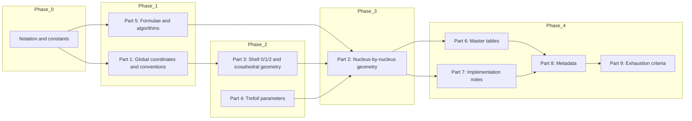

# NUCLEI PER NUCLEI Ultraplan — Excessive Detail and Mathematical Precision

## Scope and deliverable

**Input:** `SDT/investigations/nuclear_structure_probe/NUCLEI_PER_NUCLEI_ULTRAPROMPT.md` (existing).

**Output of this planning step:** A new document **`NUCLEI_PER_NUCLEI_ULTRAPLAN.md`** in the same directory. The ultraplan is the **execution specification** for producing the target document:

> **NUCLEI PER NUCLEI: Canonical Nuclear Packing Geometry in Polar Coordinates with Trefoil Structuring**

This ultraplan **does not** produce the geometry document; it produces the plan that an executor (human or AI) must follow so the geometry document meets the ultraprompt and is mathematically precise.

**Ultraplan contents (this file):**

1. **Notation and mathematical conventions** — every symbol/domain is unambiguous.
2. **Execution order and dependencies** — directed graph of sections/sub-steps.
3. **Per-Part expansion** — Parts 0–9 expanded into sub-steps with explicit formulae, domains, and verification conditions.
4. **Verification and acceptance criteria** — dimensional/consistency checks the final document must pass.
5. **File outputs and required deliverables** — the exact files/tables the executor must produce.
6. **Canonical freeze condition** — immutability and versioning rules for the canonical geometry document.

---

## 1. Notation and mathematical conventions

### 1.0 Coordinate system, domains, and conversions

**Spherical polar coordinates (MATH convention):**

- Radius: \(r \in [0,+\infty)\) (fm)
- Azimuth: \(\theta \in [0,2\pi)\) (rad), measured in the \(x\)–\(y\) plane from +x toward +y.
- Polar angle: \(\phi \in [0,\pi]\) (rad), measured from +z downward.

**Polar → Cartesian:**

\[
\begin{aligned}
 x &= r\sin\phi\cos\theta \\
 y &= r\sin\phi\sin\theta \\
 z &= r\cos\phi
\end{aligned}
\]

**Cartesian → Polar (for \(r>0\)):**

\[
\theta = \operatorname{atan2}(y,x),\qquad \phi = \arccos\left(\frac{z}{r}\right),\qquad r=\sqrt{x^2+y^2+z^2}
\]

**Behavior at \(r=0\):** define \(\theta\) and \(\phi\) as **undefined** and represent the origin as \((r,\theta,\phi)=(0,0,0)\) **by convention only**. The executor must:

- never invert \((0,\theta,\phi)\) to Cartesian using undefined angles;
- treat the origin as a special case where \(x=y=z=0\).

**Handedness:** right-handed Cartesian basis \((\hat{x},\hat{y},\hat{z})\). The polar basis follows the above mapping; report any derived unit vectors only if needed.

**One worked example (required in the geometry document):**

- \((r,\theta,\phi)=(1,0,\pi/2)\Rightarrow (x,y,z)=(1,0,0)\).

---

### 1.0.1 Vectors, indices, and sets

- \(\mathbf{p}_i\): position vector of nucleon (or cluster center) \(i\) in the global coordinate system.
- \(d_{ij}=\lVert\mathbf{p}_i-\mathbf{p}_j\rVert\): Euclidean separation.
- \(\mathbf{o}\): observer position used for occlusion evaluation.

**Index sets:**

- Nucleons: \(i\in\{1,2,\dots,A\}\).
- Clusters: e.g. alpha clusters \(\alpha_1,\alpha_2,\dots\) (cluster indexing must be explicit when used).
- Bonds: \(\mathcal{B}\subseteq \{(i,j): 1\le i<j\le A\}\).

---

### 1.0.2 Constants (symbol, value, unit, dimension)

The geometry document MUST contain a constants table with:

- symbol
- numeric value
- unit
- dimension class
- meaning
- source document path/name
- revision identifier (commit hash or equivalent), where applicable

Required constant classes include (non-exhaustive):

- \(R_{\mathrm{NUCLEON}}\) [L]
- \(d_{\mathrm{deuteron}}\) [L]
- \(d_{\alpha}\) [L]
- \(d_{\mathrm{inter}\,\alpha}\) [L]
- \(R_{\mathrm{base}}\) [L]
- \(\beta\) [1]
- \(\kappa_B\) [E/sr]

Units MUST be fm for lengths, radians for angles, steradians (sr) for solid angles, and MeV for energies unless explicitly declared otherwise.

---

### 1.0.3 Occlusion definitions

- \(\Omega(R,d)\): occlusion contribution (sr) of a sphere of radius \(R\) seen from distance \(d\).
- \(\Omega_{\mathrm{raw}}\): sum of per-nucleon contributions.
- \(\Omega_{\mathrm{corr}}\): overlap-corrected total occlusion.

All occlusion quantities MUST be clamped to \([0,4\pi]\) sr.

---

## 1.1 Determinism enforcement layer (hostile-examiner lock)

### 1.1.1 Canonical ordering rule

Every coordinate table MUST follow strict ordering:

1. **Nucleons:** order by cluster index; within each cluster by ascending \(\phi\); tie-break by ascending \(\theta\).
2. **Shell 2 interstices:** canonical index order defined by sorting by ascending \(\phi\) then ascending \(\theta\).

**Rule:** No coordinate table may be reordered between revisions unless the document version is incremented.

### 1.1.2 Floating precision policy

1. All internal calculations MUST use ≥ 64-bit floating precision (double).
2. Published coordinates MUST be rounded to exactly 6 decimal places for:
   - lengths (fm)
   - angles (rad)
3. Rounding is applied ONLY at the publication layer.
4. **Rule:** Any derived value used as input to a second calculation MUST use full precision, not the rounded table value.

---

## 1.2 Immutable parameter lock

For each constant used in the geometry document, the ultraplan requires:

- symbol
- numeric value
- source document (path/name)
- revision hash/commit reference (where applicable)

**Rule:** No numeric constant may be altered unless the ultraplan version is incremented AND all dependent values (coordinates, distances, \(\Omega\), \(B_{\mathrm{pred}}\)) are recomputed from the new constant.

---

## 1.3 Tolerance and rounding policy

- Bond-length tolerance: \(\varepsilon = 0.01\ \mathrm{fm}\) unless overridden **once** in a single canonical location.
- All distance/bond-completeness checks MUST reference \(\varepsilon\).
- Rounding only at publication (see §1.1.2).

---

## 2. Execution order and dependencies

The geometry document MUST be produced in the following dependency order.

Phases:

- **Phase 0:** Notation and constants.
- **Phase 1:** Part 1 (global coordinates, origin, conventions) and Part 5 (formulae/algorithms).
- **Phase 2:** Part 3 (shell geometry) and Part 4 (trefoil parameters).
- **Phase 3:** Part 2 (each nucleus: \(^2\mathrm{H},\ ^4\mathrm{He},\ ^8\mathrm{Be},\ ^{12}\mathrm{C},\ ^{14}\mathrm{N},\ ^{16}\mathrm{O}\)).
- **Phase 4:** Part 6 (master tables), Part 7 (implementation/consistency), Part 8 (metadata), Part 9 (exhaustion/signoff).

---

## 3. Per-Part expansion with mathematical precision

### Part 0 — Mandatory constraints

#### 0.1 Coordinate system

1. Use the convention in §1.0 (\(\theta\) azimuthal, \(\phi\) polar).
2. Domains MUST be stated explicitly.
3. **Verification:** for every polar position in the document, recompute Cartesian and verify:

\[
r^2 = x^2+y^2+z^2,\quad \phi=\arccos(z/r),\quad \theta=\operatorname{atan2}(y,x)\quad (r>0)
\]

#### 0.2 Trefoil structuring

1. For each nucleus, list building-block multiset (e.g. \(\{\alpha,\alpha,\alpha\}\) for \(^{12}\mathrm{C}\)).
2. Assign chirality \(\chi_i\in\{\mathrm{L},\mathrm{R}\}\) for each nucleon.
3. Trefoil parameters referenced (must be defined in Part 4):

- \(R_p = 0.84\ \mathrm{fm}\)
- \(r_{\mathrm{minor}} = R_p/3\)
- constraint \(v_1\,v_3=c^2\)

**Verification:** every nucleon has \(\chi_i\); every alpha cluster has four nucleons with the declared chirality pattern.

#### 0.3 Single source of truth

For each nucleus subsection, the geometry document MUST include:

- full polar coordinate list for all nucleons
- bond set \(\mathcal{B}\) and all listed \(d_{ij}\)
- observer \(\mathbf{o}\) in polar
- arrangement label

No "see elsewhere" is permitted for coordinates.

#### 0.4 Units

- All lengths: fm.
- All angles: rad (deg may appear in parentheses).

**Verification:** no untyped lengths; no free constants outside the constants index.

#### 0.5 Occlusion compatibility

For each nucleus, the geometry document MUST list:

- \(\mathbf{o}\), \(\{\mathbf{p}_i\}\), and \(R\) (global or per-nucleon)
- overlap correction uses bond set \(\mathcal{B}\)

**Verification:** \(\Omega_{\mathrm{corr}}\) computable from the nucleus subsection alone.

---

### Part 1 — Global coordinates and conventions

#### 1.1 Origin definition

Define the origin convention \(\mathbf{O}\) used throughout.

Two allowed options (choose one and apply globally):

- **Centroid origin:** \(\mathbf{O}=\frac{1}{n}\sum_{i=1}^{n}\mathbf{p}_i\) (for a chosen set of centers)
- **Anchor origin:** origin pinned to a declared nucleon (e.g. nucleon 1 for deuteron)

**Verification:** every nucleus subsection states observer relative to the same origin convention.

#### 1.2 Polar convention box

The geometry document MUST include a boxed statement of:

- forward mapping (polar → Cartesian)
- inverse mapping (Cartesian → polar)
- atan2 convention
- behavior at \(r=0\)

#### 1.3 Shell 0 (icosahedron) construction

Use golden ratio \(\varphi=(1+\sqrt{5})/2\). The unnormalized vertices are:

- \((\pm 1,\pm\varphi,0)\)
- \((\pm\varphi,0,\pm 1)\)
- \((0,\pm 1,\pm\varphi)\)

Normalize all to radius \(r_0=2R_{\mathrm{NUCLEON}}\):

\[
\mathbf{v}_k = r_0\,\frac{\mathbf{u}_k}{\lVert \mathbf{u}_k\rVert}
\]

Deliverable: table of 12 vertices with:

- index
- \((r,\theta,\phi)\)
- \((x,y,z)\)

**Verification:** \(\lVert\mathbf{v}_k\rVert=r_0\) for all 12; all 12 points distinct.

#### 1.4 Shell 1 interstices

Define Shell 1 sites as explicit functions of Shell 0 vertices (choose and document one method):

- centroid(s) of declared vertex subsets, or
- midpoints of declared edges

Deliverable: exactly two Shell 1 sites in polar and Cartesian.

**Verification:** distances to nearest Shell 0 vertices are stated and reproducible.

#### 1.5 Shell 2 interstices — fork resolution (mandatory)

The executor MUST resolve the dual-source risk.

**Option A (preferred):** Choose ONE canonical generation method and use it exclusively:

- Analytical (icosahedral face centroids), OR
- Code-generated `SHELL2_INTERSTICES`.

**Option B (allowed only if explicit):** retain both methods with an override rule:

> If analytical construction and code output differ by more than \(\varepsilon\) in Cartesian norm for any index, the analytical construction overrides code output.

Shell 2 radius:

\[
R_2 = 2.5\,R_{\mathrm{NUCLEON}}
\]

Deliverable: 20 Shell 2 points in canonical order (sorted by \(\phi\) then \(\theta\)), each with \((\theta_i,\phi_i)\) and Cartesian coordinates.

**Verification:** \(\lVert\mathbf{s}_i\rVert=R_2\) for all 20; all points distinct.

---

### Part 2 — Nucleus-by-nucleus geometry

For each nucleus \(^2\mathrm{H},\ ^4\mathrm{He},\ ^8\mathrm{Be},\ ^{12}\mathrm{C},\ ^{14}\mathrm{N},\ ^{16}\mathrm{O}\), the geometry document MUST contain the following subsections.

#### 2.A Identity

- \((Z,N)\), symbol, name
- arrangement type (from a fixed vocabulary)
- building-block string (e.g. `3α`)
- any cross-reference key used in code/data stores

#### 2.B Polar coordinates (primary truth)

Deliverable: **Primary coordinate table** with columns:

- nucleon index \(i\)
- type (p/n or cluster membership)
- \(r_i\), \(\theta_i\), \(\phi_i\)
- chirality \(\chi_i\)

Also provide a derived Cartesian table computed from those values.

If using clusters (alpha centers), list alpha centers first, then internal nucleons.

**Alpha internal tetrahedron (local model):**

Let tetrahedron edge length be \(d_{\alpha}\). In a local Cartesian frame centered at the alpha center, use vertices:

\[
\mathbf{t}_1 = \frac{d_{\alpha}}{\sqrt{2}}(+1,+1,+1),\quad
\mathbf{t}_2 = \frac{d_{\alpha}}{\sqrt{2}}(+1,-1,-1),\quad
\mathbf{t}_3 = \frac{d_{\alpha}}{\sqrt{2}}(-1,+1,-1),\quad
\mathbf{t}_4 = \frac{d_{\alpha}}{\sqrt{2}}(-1,-1,+1)
\]

(Executor may permute vertex assignment ONLY if chirality constraints are satisfied and the permutation is documented.)

**Orientation:** if the tetrahedron is rotated into global coordinates, the rotation MUST be specified (axis + angle or full rotation matrix) and must be deterministic.

**Verification:** for every bonded pair, \(|d_{ij}-d_{\mathrm{expected}}|<\varepsilon\) where \(d_{\mathrm{expected}}\in\{d_{\mathrm{deuteron}}, d_{\alpha}, d_{\mathrm{inter}\,\alpha}\}\) as applicable.

#### 2.C Bond topology

Deliverable:

- explicit bond set \(\mathcal{B}\)
- for every \((i,j)\in\mathcal{B}\), list \(d_{ij}\)
- observer \(\mathbf{o}=(r_{\mathrm{obs}},\theta_{\mathrm{obs}},\phi_{\mathrm{obs}})\)

If using centroid observer, define:

\[
\mathbf{o}=\frac{1}{A}\sum_{i=1}^{A}\mathbf{p}_i
\]

**Verification:** all \(d_{ij}\) reproduce from coordinates; observer is consistent with origin convention.

#### 2.D Occlusion

Deliverable:

- radius parameter \(R\) (single value OR explicit rule \(R(n_{\mathrm{bonds}})\))
- overlap correction specification applied
- computed \(\Omega_{\mathrm{corr}}\) and predicted binding \(B_{\mathrm{pred}}\)

**Verification:** \(\Omega_{\mathrm{corr}}\in[0,4\pi]\) and \(B_{\mathrm{pred}}=\kappa_B\,\Omega_{\mathrm{corr}}\).

#### 2.E Trefoil data

Deliverable:

- phase angles \(\psi_i\) (rad) for each nucleon
- rotation axis (\(\theta_{\mathrm{axis}},\phi_{\mathrm{axis}}\))
- rotation rate \(\omega\) (rad/s)

**Verification:** chirality/phase satisfy Part 4 rules.

#### 2.F Validation block

Deliverable:

- \(\Omega_{\mathrm{corr}}\), \(B_{\mathrm{pred}}\), \(B_{\mathrm{exp}}\)
- relative error \(|B_{\mathrm{pred}}-B_{\mathrm{exp}}|/B_{\mathrm{exp}}\)
- code reference (file + function/class name)

---

### Part 3 — Shell geometry (0/1/2) and mapping

#### 3.1 Shell 0 table

Must reproduce the 12-vertex table from Part 1 with both polar and Cartesian coordinates.

#### 3.2 Shell 1 table

Must reproduce the two Shell 1 sites with derivation and verification distances.

#### 3.3 Shell 2 table

Must reproduce the 20 Shell 2 sites with \(R_2=2.5R_{\mathrm{NUCLEON}}\), canonical ordering, and verification \(r=R_2\) for all.

#### 3.4 Shell 2 mapping to nuclei

For nuclei using Shell 2 positions as alpha centers (e.g. \(^{12}\mathrm{C}\), \(^{16}\mathrm{O}\)), the geometry document MUST state:

- which Shell 2 indices correspond to which cluster centers
- any alignment reconciliations vs Phase 01 radii (e.g. 2.9 fm vs \(R_2\))

---

### Part 4 — Trefoil parameters

#### 4.1 6π trefoil geometry

- \(R_p=0.84\ \mathrm{fm}\)
- \(r_{\mathrm{minor}}=R_p/3\)
- winding: \(6\pi\)
- compactness \(\kappa_p\) (formula + value from trefoil reference)

**Verification:** dimensions correct ([L], [L], [1]).

#### 4.2 Three-velocity constraint

- \(v_1=2.23c\)
- \(v_2=1.84c\)
- \(v_3=c^2/v_1\)
- constraint: \(v_1v_3=c^2\)

**Verification:** numeric check \((v_1v_3)/c^2=1\).

#### 4.3 Rotation and phase mapping

- \(\omega\) defined in rad/s
- phase-to-velocity mapping \(v(\psi)=f(v_1,v_2,v_3,\psi)\) provided symbolically OR referenced to a single, stable source

#### 4.4 Chirality rules

- Deuteron chirality rule (e.g. L–R)
- Alpha chirality rule (e.g. L–R–L–R)
- Special cases (e.g. \(^{14}\mathrm{N}\) center nucleon)

**Verification:** every nucleus satisfies chirality assignment rules.

#### 4.5 Electron-sharing references

Reference-only (p–p–e, four-way, T-units). No new positions may be introduced unless fully specified in Part 2.

---

### Part 5 — Formulae and algorithms

#### 5.1 Spherical occlusion (piecewise, with domain guardrails)

The geometry document MUST state \(\Omega(R,d)\) in **piecewise form**:

\[
\Omega(R,d)=
\begin{cases}
0, & d \le 0 \\
4\pi, & 0<d\le R \\
2\pi\left(1-\sqrt{1-(R/d)^2}\right), & d>R
\end{cases}
\]

Then clamp to \([0,4\pi]\) if needed.

**Dimensional check:** \([R]=[d]=\mathrm{L}\), \([\Omega]=\mathrm{sr}\).

**Verification:** provide one numeric worked example.

#### 5.2 Polar–Cartesian conversion

Must reproduce §1.0 conversion box. Provide one round-trip numeric example.

#### 5.3 Overlap correction (symbolic requirement)

Define:

\[
\Omega_{\mathrm{raw}} = \sum_{i=1}^{A} \Omega\big(R,\lVert\mathbf{o}-\mathbf{p}_i\rVert\big)
\]

Overlap correction MUST be defined **symbolically** or as a fully specified algorithm. Code reference alone is insufficient.

For all pairs \((i,j)\) eligible for overlap (criterion MUST be stated; default: \(d_{ij}<2R\)), compute overlap term \(\Delta\Omega_{ij}\) and set:

\[
\Omega_{\mathrm{corr}} = \operatorname{clamp}_{[0,4\pi]}\left(\Omega_{\mathrm{raw}} - \sum_{(i,j)\in \mathcal{P}} \Delta\Omega_{ij}\right)
\]

where \(\mathcal{P}\) is the declared overlap-pair set.

**Verification:** algorithm/formula present; no free parameters.

#### 5.4 Inter-alpha radius rule

\[
R(n)=R_{\mathrm{base}}\left(1+\beta\frac{(n-3)}{3}\right),\quad n\in\{1,3,6\}
\]

Provide table \(n\mapsto R(n)\). Verify stated numeric values.

#### 5.5 Alpha internal derived radii

Let \(d_{\alpha}\) be tetrahedron edge length.

- center-to-vertex:

\[
\ell_{\alpha}= d_{\alpha}\sqrt{\frac{3}{8}}
\]

- effective alpha radius:

\[
R_{\alpha} = \ell_{\alpha} + R_{\mathrm{NUCLEON}}
\]

**Verification:** all six tetrahedron edges equal \(d_{\alpha}\) within \(\varepsilon\).

---

### Part 6 — Tables and indices

#### 6.1 Master table: nuclei

Columns MUST include:

- \(Z\), \(N\), symbol, arrangement, building blocks, \(A\)
- observer \(\mathbf{o}\) in polar
- \(R\) (fm)
- \(\Omega_{\mathrm{corr}}\) (sr)
- \(B_{\mathrm{pred}}\) (MeV)
- \(B_{\mathrm{exp}}\) (MeV)
- section reference

**Verification:** every nucleus in Part 2 appears; values match Part 2.

#### 6.2 Master table: Shell 2

- index \(i\)
- \(\theta_i\), \(\phi_i\)
- \(x_i\), \(y_i\), \(z_i\)
- optional "used by" mapping

**Verification:** 20 rows; \(r=R_2\) for all.

#### 6.3 Constants index

Must include every constant used anywhere in the geometry document.

---

### Part 7 — Implementation and consistency

#### 7.1 Phase 01 vs trefoil reconciliation

A reconciliation table MUST list each quantity where Phase 01 differs from trefoil conventions:

- quantity name
- Phase 01 value
- trefoil value
- canonical choice in the geometry document

**Verification:** exactly one canonical value is chosen per quantity.

#### 7.2 Occlusion pipeline (numbered steps)

Define an explicit input/output pipeline (minimum 7 steps):

1. read constants
2. read nucleus polar coordinates
3. convert to Cartesian
4. compute distance matrix
5. compute \(\Omega_{\mathrm{raw}}\)
6. compute overlap corrections
7. compute \(\Omega_{\mathrm{corr}}\) and \(B_{\mathrm{pred}}\)

No "and then compute" statements without formulas or table references.

#### 7.3 Extensibility rule

Provide a deterministic rule for extending to unlisted nuclei (e.g. \(A>40\)):

- how to place new centers (Shell mapping rule)
- how to set \(\mathbf{o}\)
- how to choose \(R\)

**Verification:** rule is deterministic and uses only declared constants/algorithms.

---

### Part 8 — Metadata

The geometry document MUST include:

- version
- date
- author/source line
- reference list (all paths)
- revision table
- certification sentence

**Verification:** every referenced file exists or is cited by name.

---

### Part 9 — Exhaustion criteria (executor signoff)

The executor MUST complete and sign off the checklist:

1. Every position is specified in polar.
2. Every nucleus has a bond set \(\mathcal{B}\) and observer \(\mathbf{o}\).
3. Every constant used appears in the constants index.
4. No "see Phase 01" or external reference is used in place of coordinates.
5. Chirality and trefoil phase data are present per nucleon.
6. Any omission is explicit and justified.

---

## 4. Verification and acceptance criteria

### 4.1 Base criteria

- **Dimensional consistency:** every equation checked for [L], [1], [E], [E/sr], [sr] as appropriate.
- **Numeric consistency:** for \(^2\mathrm{H}\) and \(^4\mathrm{He}\), recompute \(\Omega_{\mathrm{corr}}\) and \(B_{\mathrm{pred}}\) from stated geometry/constants and match within 0.1% (or declared tolerance).
- **Completeness:** every subsection of Parts 1–9 present or explicitly omitted with reason.
- **Traceability:** every number in master tables traceable to a formula or Part 2 subsection.

### 4.2 Geometric closure tests (graph-theoretic and invariance)

#### 4.2.1 Distance matrix symmetry

For each nucleus define \(D_{ij}=\lVert\mathbf{p}_i-\mathbf{p}_j\rVert\). Require:

\[
D_{ij}=D_{ji}\quad\forall i,j
\]

#### 4.2.2 Bond completeness check

Bond set \(\mathcal{B}\) MUST satisfy:

1. No duplicate pairs.
2. For all \((i,j)\in\mathcal{B}\): \(|D_{ij}-d_{\mathrm{expected}}(i,j)|<\varepsilon\).
3. No unlisted pair \((k,\ell)\notin\mathcal{B}\) has \(|D_{k\ell}-d_{\mathrm{expected}}|<\varepsilon\) for any bond length class (no "missing bond").

#### 4.2.3 Rigid-body invariance

If \(\mathbf{p}'_i=R\mathbf{p}_i+\mathbf{t}\) with \(R\in SO(3)\), \(\mathbf{t}\in\mathbb{R}^3\), then:

- all distances \(D_{ij}\) unchanged
- all occlusion totals unchanged
- \(B_{\mathrm{pred}}\) unchanged

### 4.3 Occlusion domain conditions (formal)

The occlusion function MUST be piecewise-defined (see §5.1) with explicit handling of edge cases.

### 4.4 Reconstruction test (single-document sufficiency)

**Mandatory acceptance clause:** Using only the geometry document master tables and Part 5 formulae, a third party must be able to regenerate:

- all Cartesian coordinates
- all distance matrices \(D_{ij}\)
- all occlusion totals \(\Omega_{\mathrm{corr}}\)
- all binding predictions \(B_{\mathrm{pred}}\)

**without referencing any external document** (no Phase 01 code, no separate constants file unless reproduced in the geometry document).

### 4.5 Single source restatement

A reader can compute \(\Omega_{\mathrm{corr}}\) and \(B_{\mathrm{pred}}\) for every listed nucleus using only the canonical geometry document and its formulae.

---

## 5. File outputs and required deliverables

### 5.1 New file produced by executing this ultraplan

- **Path:** `SDT/investigations/nuclear_structure_probe/NUCLEI_PER_NUCLEI.md` (the canonical geometry document; produced later by executing this plan)

### 5.2 Tables that MUST exist in the geometry document

- constants index (§6.3)
- Shell 0/1/2 tables (§1.3–1.5 / Part 3)
- per-nucleus primary polar coordinate tables (§2.B)
- per-nucleus bond sets and distances (§2.C)
- master nuclei table (§6.1)

### 5.3 Required references list (paths/names)

The geometry document must cite (by name/path) all upstream sources it used, including at minimum:

- `NUCLEI_PER_NUCLEI_ULTRAPROMPT.md`
- `SDT/SDT_CANONICAL_PHYSICS_ENGINE_v4.md` (Section 0: constants; Section 7: trefoil topology; Section 10–11: mass/occlusion, deuteron)
- nuclear constants source (e.g. `NUCLEAR_CONSTANTS` document)
- trefoil specification source (e.g. `TREFoil` document)
- any Phase 01/02 references used only as comparison (not as coordinate source)
- any generator or mapping scripts (names + revision hashes)

---

## 6. Canonical freeze condition (final hardening layer)

Once the canonical geometry document (`NUCLEI_PER_NUCLEI.md`) is generated:

1. It becomes the **immutable geometric baseline** for the nuclear structure probe.
2. All future models/validators (Phase 01, trefoil validators, ATOMICUS, etc.) MUST reference it rather than regenerating geometry.
3. Any change to:
   - coordinates
   - bond sets
   - observer definitions
   - constants

   requires:

   - a **version bump** of the canonical geometry document, AND
   - full recomputation of:
     - occlusion totals
     - distance matrices
     - bond completeness checks
     - binding outputs

No "minor tweak" is permitted without recomputation and version increment.

---

## Appendix A — Executor quick checklist

- [ ] Notation and conventions fixed (no drift)
- [ ] Determinism rules implemented (ordering + precision)
- [ ] Constants locked (with revision identifiers)
- [ ] Shell 2 fork resolved (single method or override rule)
- [ ] Occlusion piecewise + overlap symbolic spec present
- [ ] Per-nucleus geometry complete (coords, bonds, observer, trefoil)
- [ ] Closure tests pass (symmetry, completeness, invariance)
- [ ] Reconstruction test passes (single-document sufficiency)
- [ ] Canonical freeze policy included and followed
